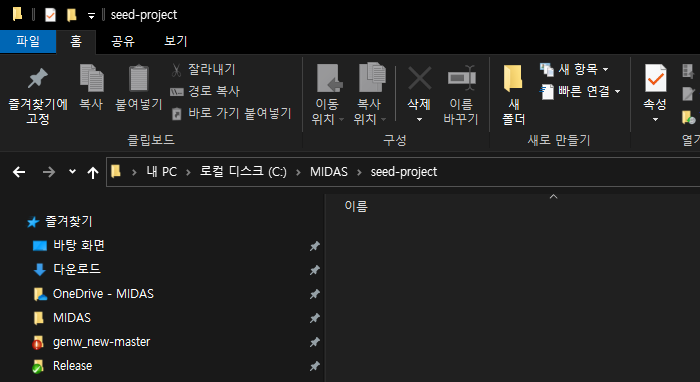
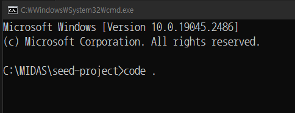
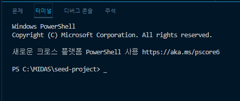
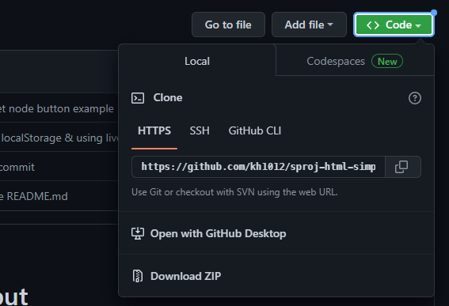
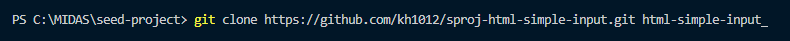
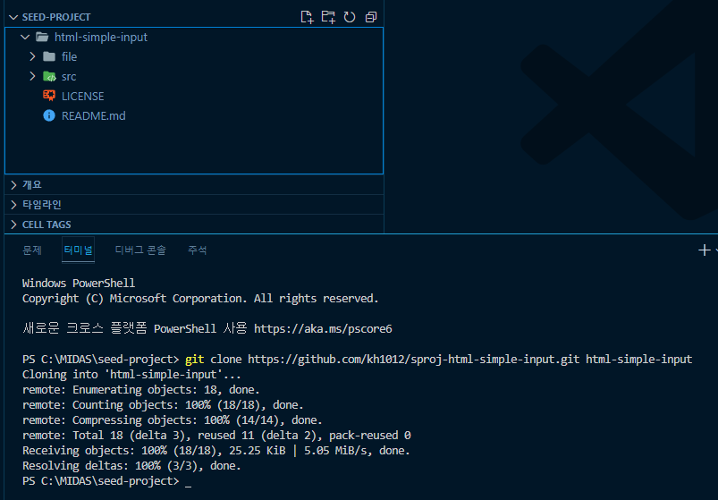
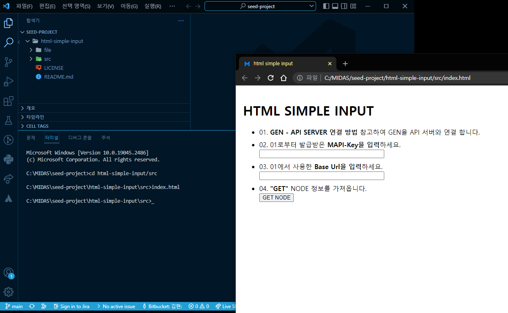

# sproj-html-simple-input
Midas API Seed Project - html simple input

MIDAS API 중 "GET NODE"를 통해 API를 경험할 수 있는 Repository 입니다.

HTML button 태그를 이용해서 DOM Element의 innerHTML을 치환하여 브라우져 UI에 API로부터 받은 데이터를 출력하는 예제 입니다.

# Getting Started HTML Simple Input
단순입력 예제를 시작하기 위해 아래의 절차에 따라 Setting 해주시면 됩니다.

1. <a href="https://github.com/kh1012/sproj-prerequisite/tree/main/html">Seed Project Prerequiste HTML</a>을 참고하여 기본적인 Setting을 진행합니다.

2. 파일탐색기를 열어 seed-project를 clone할 경로를 지정하여 띄웁니다.

3. 파일 주소창에 "cmd"을 입력 합니다. (커맨드를 띄웁니다.)
4. 열려진 cmd창에 "code ."을 입력 합니다. (VSCode를 해당 경로에서 실행시키는 방법입니다.)

5. VSCode가 열렸다면 상단 메뉴 중 `보기-터미널`을 선택하여 터미널을 오픈 합니다.

6. 현재 페이지 상단에 있는 Code 버튼을 눌러 현재 저장소의 HTTPS 경로를 클립보드에 복사 합니다.

7. VSCode의 터미널에 clone 명령을 통해 현재 저장소를 복제 합니다.

`git clone [현 저장소 HTTPS 경로] [지정할 폴더명]`

`git clone https://github.com/kh1012/sproj-html-simple-input.git html-simple-input`

8. 정상적으로 clone이 완료되면 아래와 같은 모습 입니다.

9. 터미널에서 복제된 경로로 이동한 뒤 "index.html"을 실행했을 때, 브라우져가 띄워지면 1차 성공 입니다.

# Usage
## 